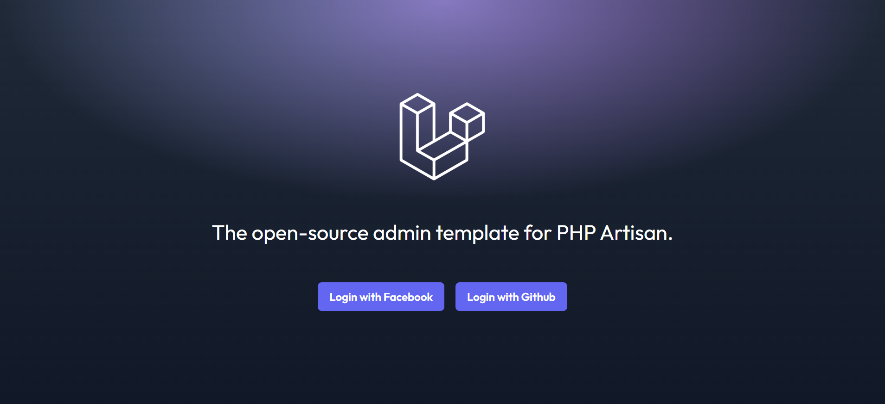
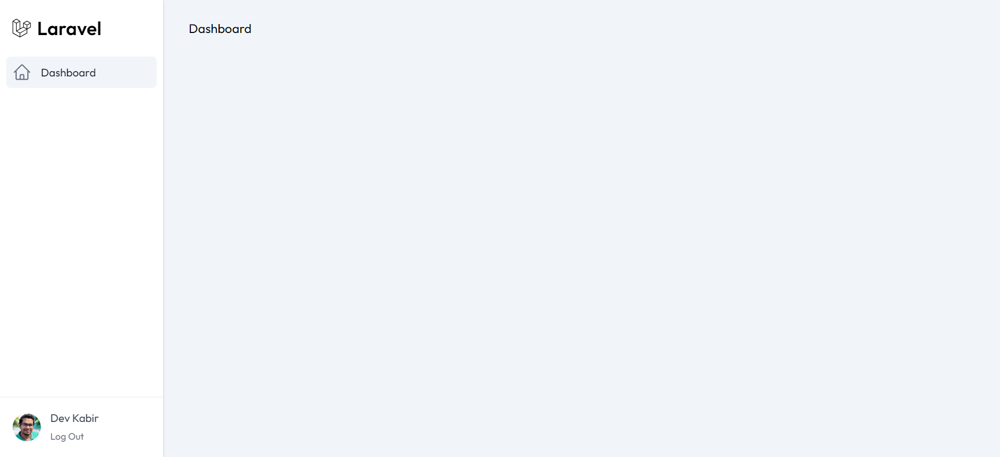

# Laravel Splade Starter

You start your laravel app development with [splade](https://splade.dev) by using this repository.

# Features
- Laravel Social Auth Implemented. All you have to do is update your social app credential
- Admin template design with responsive sidebar.

# Installation

- clone this repo
- run 
```bash
composer install
npm install
cp .env.example .env
```
- Update env and run
```bash
php artisan key:generate
php artisan migrate
npm run dev
```
- add social app credentials in .env

That's it.

# How it looks

- Web 


- Admin Template 


